# ⚽ Football Management App

Aplikasi manajemen sepak bola yang lengkap dan modern, dibangun dengan Flutter dan GetX. Aplikasi ini memungkinkan pengelolaan tim, pemain, jadwal pertandingan, dan statistik dengan antarmuka yang intuitif dan responsif.

## 📱 Fitur Utama

### 🏠 Dashboard
- **Statistik Real-time** - Total tim, jadwal, dan pemain
- **Jadwal Hari Ini** - Pertandingan yang dijadwalkan hari ini
- **Tim Terdaftar** - Daftar tim yang terdaftar dalam sistem
- **Pull-to-Refresh** - Update data dengan mudah

### ⚽ Manajemen Tim
- **CRUD Tim** - Buat, lihat, edit, dan hapus tim
- **Detail Tim** - Informasi lengkap tim (nama, tahun berdiri, kota, stadion)
- **Logo Tim** - Upload dan tampilkan logo tim
- **Daftar Pemain** - Kelola pemain dalam tim
- **Laporan Pertandingan** - Riwayat pertandingan tim

### 👥 Manajemen Pemain
- **CRUD Pemain** - Buat, lihat, edit, dan hapus pemain
- **Profil Pemain** - Foto, nama, posisi, nomor punggung
- **Statistik Pemain** - Tinggi, berat badan, posisi
- **Filter per Tim** - Lihat pemain berdasarkan tim

### 📅 Manajemen Jadwal
- **CRUD Jadwal** - Buat, lihat, edit, dan hapus jadwal
- **Detail Pertandingan** - Tim home/away, tanggal, waktu, lokasi
- **Input Hasil** - Masukkan skor pertandingan
- **Pencetak Gol** - Catat pemain yang mencetak gol
- **Status Pertandingan** - Upcoming, live, atau finished

### 📊 Statistik & Laporan
- **Dashboard Stats** - Total tim, jadwal, pemain
- **Hasil Pertandingan** - Skor dan pemenang
- **Top Scorer** - Pemain dengan gol terbanyak
- **Riwayat Pertandingan** - History per tim

### 👤 Profil & Akun
- **Edit Profil** - Update nama, username, email
- **Foto Profil** - Upload foto profil
- **Ganti Password** - Keamanan akun
- **Logout** - Keluar dari aplikasi

## 🎨 Screenshots

<!-- Tambahkan screenshot aplikasi Anda di sini -->
<div align="center">
  <p><i>Screenshots aplikasi akan ditampilkan di sini</i></p>
  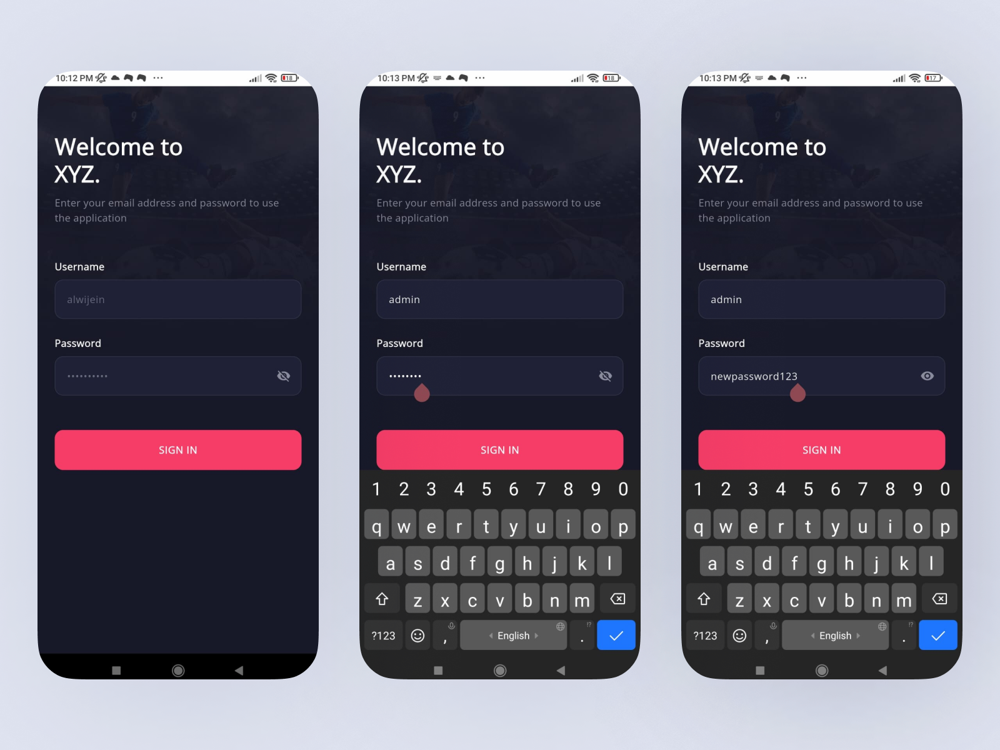
  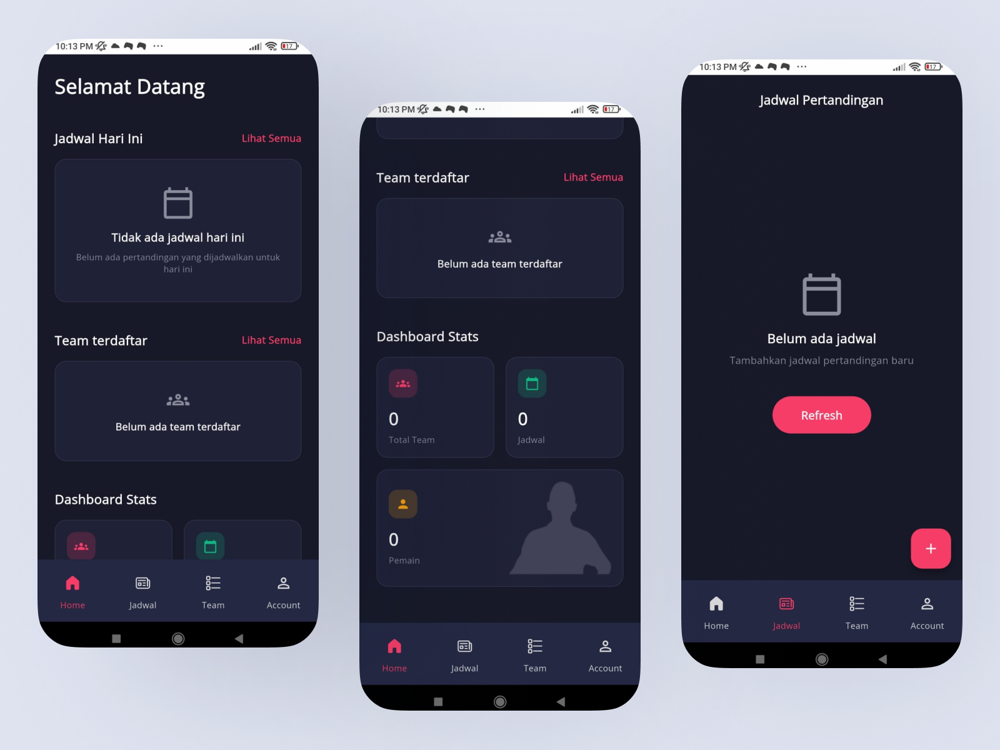
  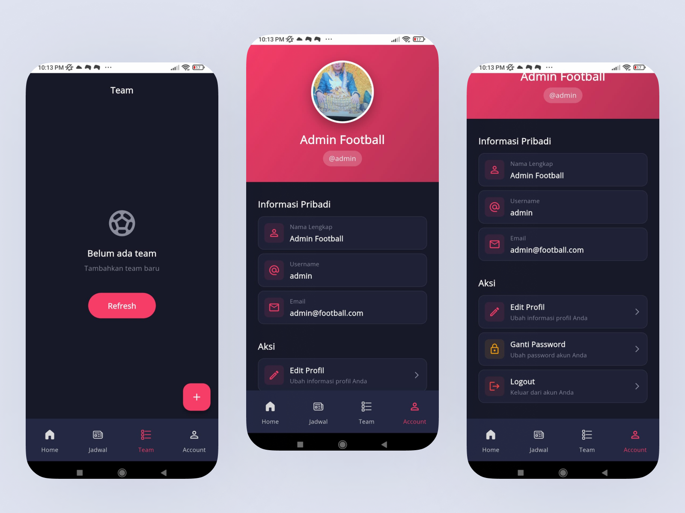
  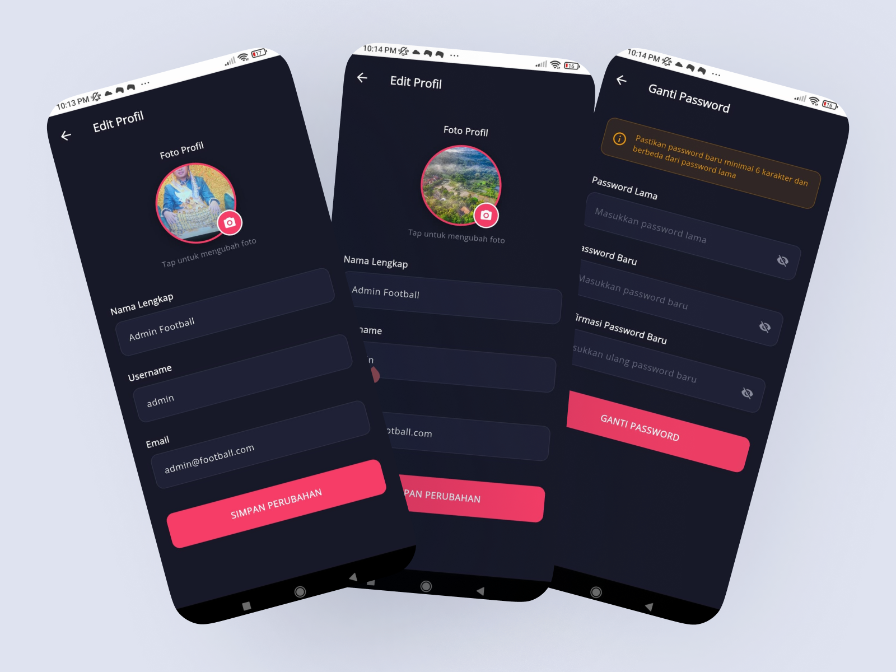
  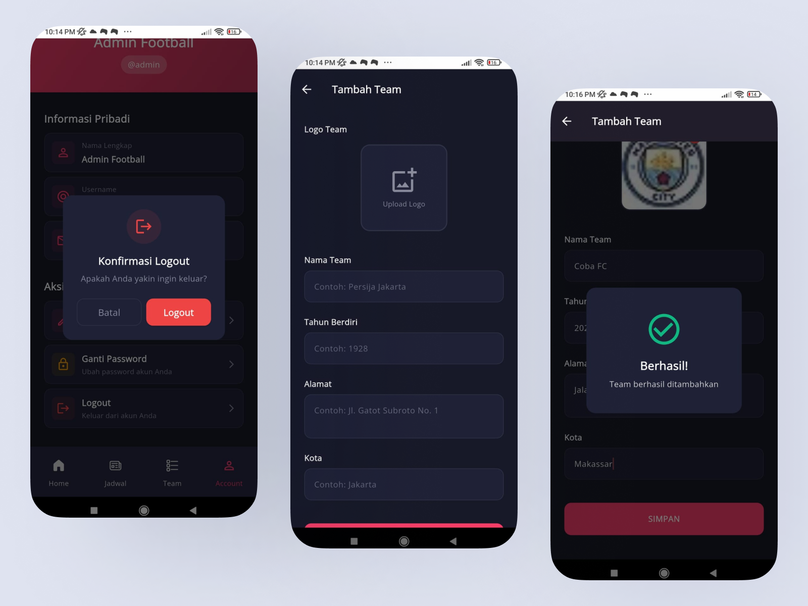
  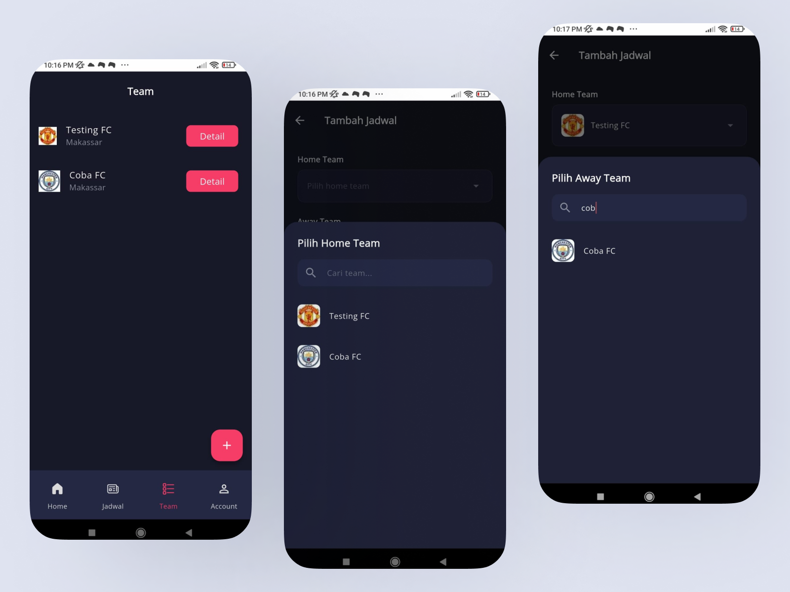
  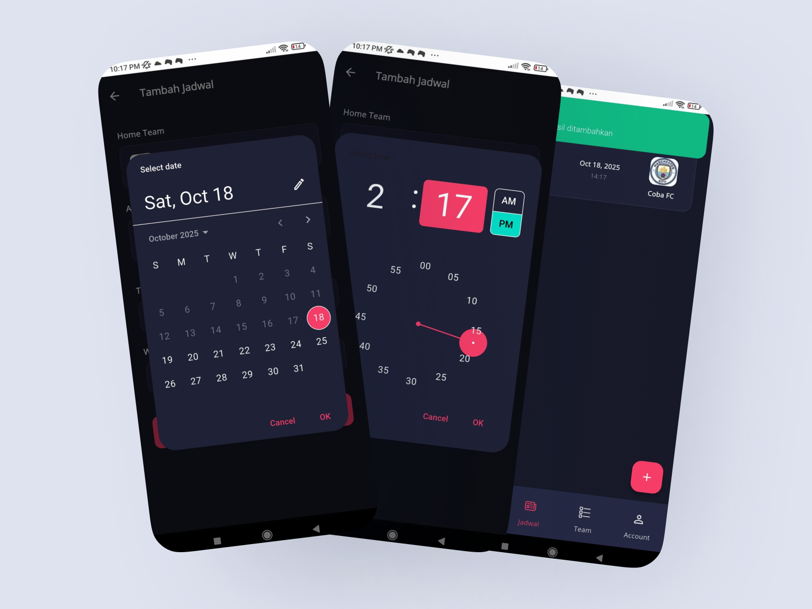
  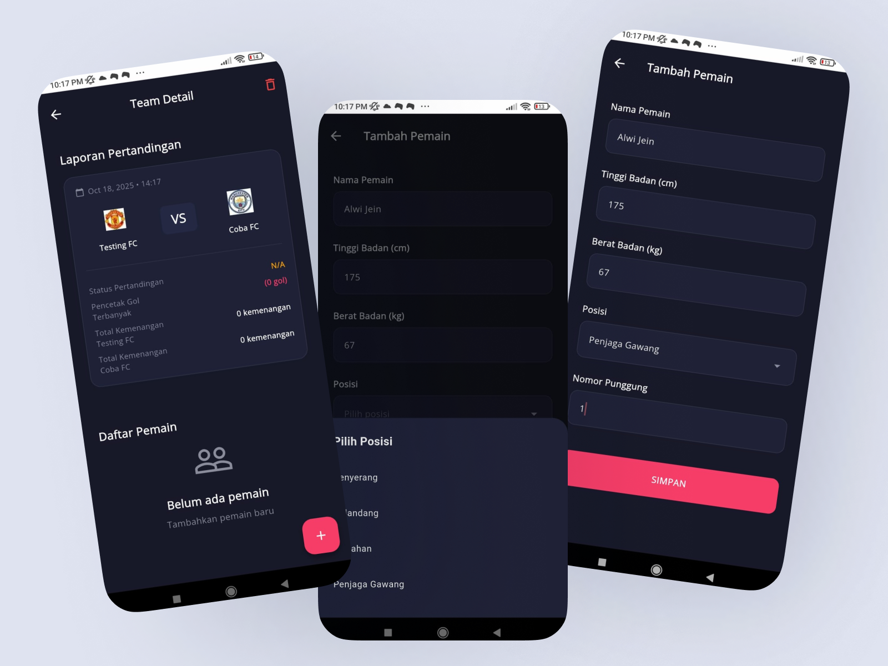
  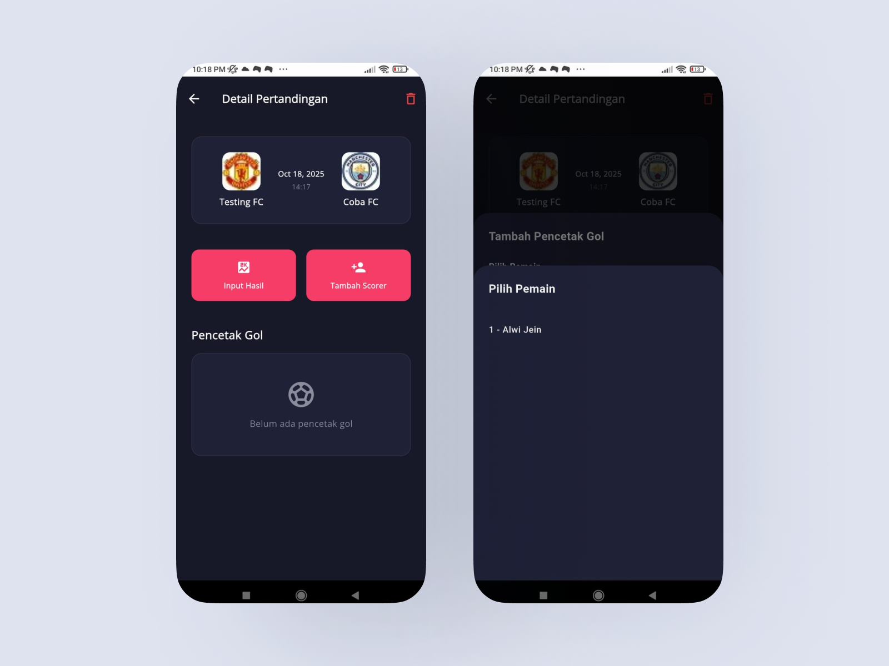
  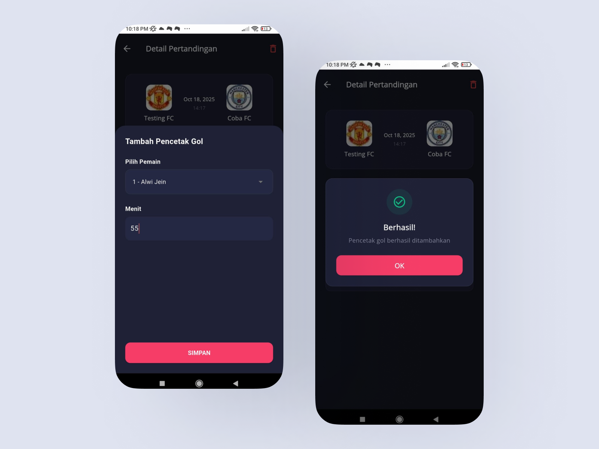
  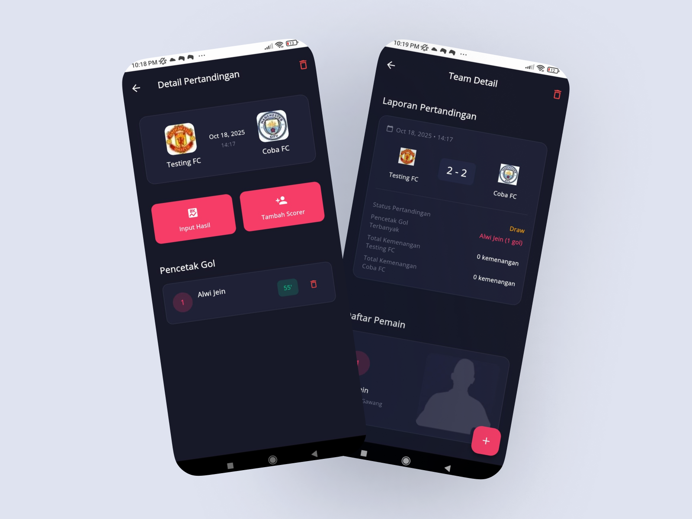
  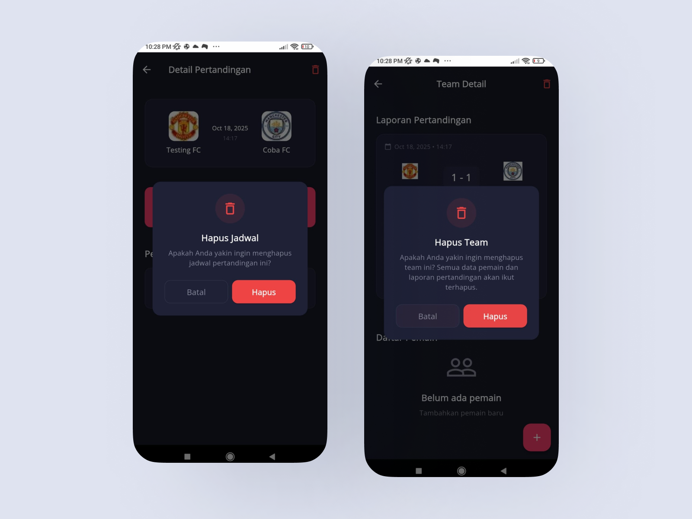
  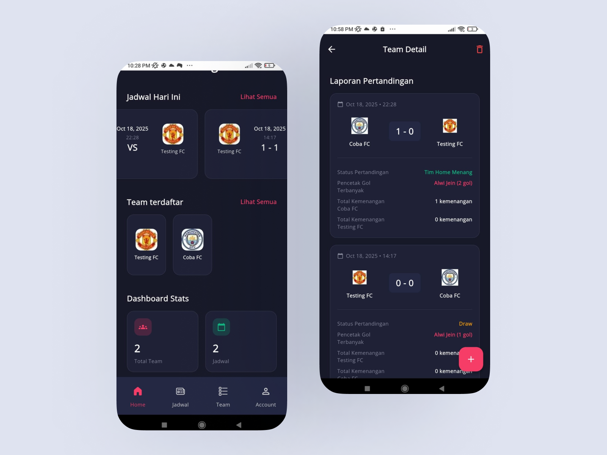
</div>

## 🏗️ Arsitektur & Teknologi

### Tech Stack
- **Framework**: Flutter 3.x
- **State Management**: GetX
- **Architecture**: Clean Architecture
- **API Integration**: RESTful API with Dio
- **Local Storage**: GetStorage
- **Image Handling**: Image Picker
- **Code Generation**: Freezed, JSON Serializable

### Struktur Project
```
lib/
├── app/
│   ├── data/           # Models & Data Sources
│   ├── modules/        # Feature Modules
│   │   ├── home/
│   │   ├── team/
│   │   ├── jadwal/
│   │   ├── profil/
│   │   └── widgets/    # Global Widgets
│   ├── routes/         # Navigation Routes
│   └── domain/         # Repositories & Entities
├── config/             # App Configuration
├── styles/             # Design System
│   ├── color_schema_collections.dart
│   ├── typography_collections.dart
│   └── spacings_collections.dart
├── utils/              # Utilities & Helpers
└── main.dart
```

### Design Pattern
- **State Management**: Enum-based states with Rx observables
- **Error Handling**: Either pattern with ErrorDto
- **Dependency Injection**: Constructor injection via GetX bindings
- **Widget Composition**: Reusable global widgets
- **Shimmer Loading**: Custom shimmer untuk setiap komponen
- **Modal Feedback**: ErrorModal & SuccessModal

### Global Widgets
- `ConfirmationDialog` - Dialog konfirmasi dengan variants
- `EmptyStateWidget` - Widget untuk empty state (centered/card layout)
- `ErrorModal` - Modal error dengan retry action
- `SuccessModal` - Modal success dengan auto-close
- `ShimmerLoading` - Base shimmer dengan 12 variants
- `DefaultButton` - Button component
- `DefaultTextField` - Text field component

## 🎨 Design System

Aplikasi ini mengikuti design system yang konsisten dan modern.

### Design Resources
Desain UI/UX terinspirasi dari:
- [Football Mobile App Design](https://www.figma.com/community/file/1161200886756474399)
- [Soccer App Design](https://www.figma.com/community/file/1012689727469655245)

### Color Schema
- **Primary**: Accent colors untuk actions & highlights
- **Card**: Background untuk cards & containers
- **Surface**: Surface background colors
- **Border**: Border colors
- **Error**: Error & danger states
- **Success**: Success states

### Typography
- **Heading**: Font sizes 18-24px, weight 600-700
- **Body**: Font sizes 14-16px, weight 400-500
- **Caption**: Font sizes 11-12px, weight 400-500

### Spacing
Menggunakan `SpacingCollections` dengan skala konsisten (xs, sm, md, lg, xl, xxl, xxxl, dll)

## 🚀 Cara Menjalankan Project

### Prerequisites

Pastikan Anda sudah menginstall:
- **Flutter SDK** (version 3.0.0 atau lebih tinggi)
- **Dart SDK** (version 3.0.0 atau lebih tinggi)
- **Android Studio** / **VS Code** dengan Flutter extension
- **Emulator Android** / **iOS Simulator** / **Physical Device**

### Langkah Instalasi

1. **Clone Repository**
   ```bash
   git clone <repository-url>
   cd fe_football
   ```

2. **Install Dependencies**
   ```bash
   flutter pub get
   ```

3. **Generate Code** (untuk Freezed & JSON Serializable)
   ```bash
   flutter pub run build_runner build --delete-conflicting-outputs
   ```

4. **Konfigurasi Backend**
   
   Update base URL di `lib/config/config.dart`:
   ```dart
   static const String baseUrl = 'http://your-api-url.com/api';
   ```

5. **Run Application**
   
   Untuk development:
   ```bash
   flutter run
   ```
   
   Untuk mode release:
   ```bash
   flutter run --release
   ```

### Platform Specific

#### Android
```bash
flutter run -d android
```

#### iOS (hanya di macOS)
```bash
flutter run -d ios
```

#### Web
```bash
flutter run -d chrome
```

### Build APK/IPA

**Android APK**:
```bash
flutter build apk --release
```

**Android App Bundle**:
```bash
flutter build appbundle --release
```

**iOS** (macOS only):
```bash
flutter build ios --release
```

### Troubleshooting

**Masalah: Dependencies tidak ter-install**
```bash
flutter clean
flutter pub get
```

**Masalah: Build runner error**
```bash
flutter pub run build_runner clean
flutter pub run build_runner build --delete-conflicting-outputs
```

**Masalah: Gradle sync error (Android)**
```bash
cd android
./gradlew clean
cd ..
flutter clean
flutter pub get
```

## 📦 Dependencies Utama

```yaml
# State Management
get: ^4.6.6
get_storage: ^2.1.1

# Network
dio: ^5.4.0

# Code Generation
freezed: ^2.4.6
json_serializable: ^6.7.1
build_runner: ^2.4.7

# UI Components
shimmer: ^3.0.0
image_picker: ^1.0.7
```

## 📝 API Endpoints

Backend API yang digunakan:

### Authentication
- `POST /login` - Login user
- `POST /logout` - Logout user

### Teams
- `GET /teams` - Get all teams
- `GET /teams/{id}` - Get team detail
- `POST /teams` - Create team
- `PUT /teams/{id}` - Update team
- `DELETE /teams/{id}` - Delete team

### Players
- `GET /teams/{teamId}/players` - Get team players
- `POST /teams/{teamId}/players` - Create player
- `PUT /players/{id}` - Update player
- `DELETE /players/{id}` - Delete player

### Schedules
- `GET /schedules` - Get all schedules
- `GET /schedules/{id}` - Get schedule detail
- `POST /schedules` - Create schedule
- `PUT /schedules/{id}` - Update schedule
- `DELETE /schedules/{id}` - Delete schedule

### Profile
- `GET /profile` - Get user profile
- `PUT /profile` - Update profile
- `PUT /profile/password` - Change password


## 📄 License

Project ini dibuat untuk keperluan pembelajaran dan portfolio.

## 👨‍💻 Developer

Developed with ❤️ using Flutter & GetX

---

<div align="center">
  <p>⚽ Happy Coding! ⚽</p>
</div>
